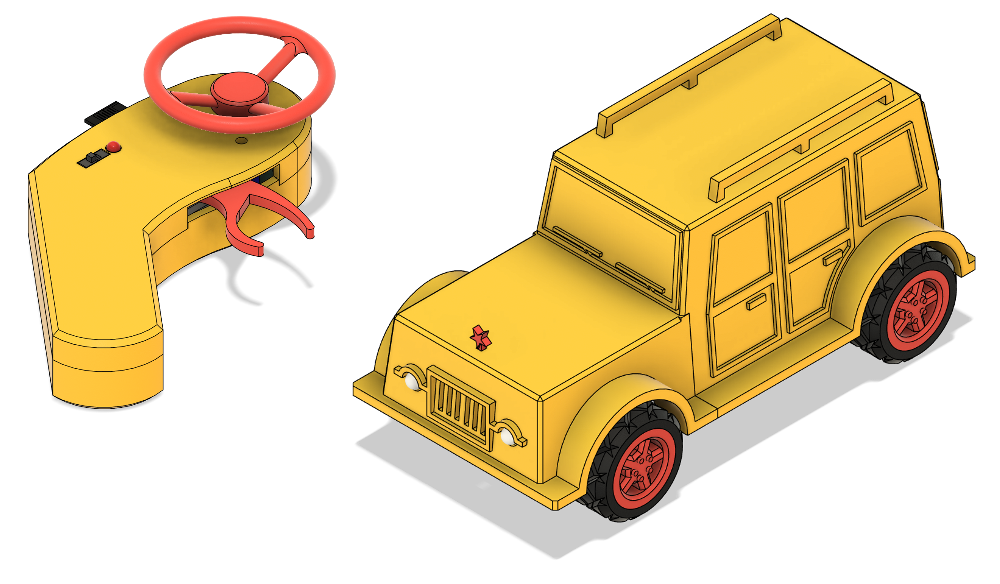
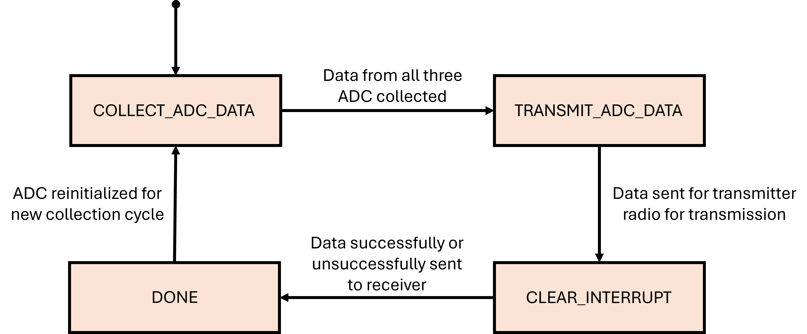
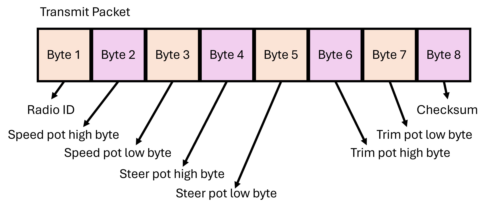
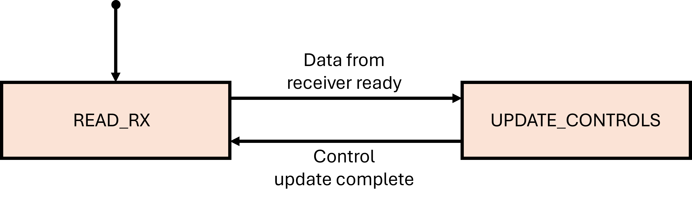
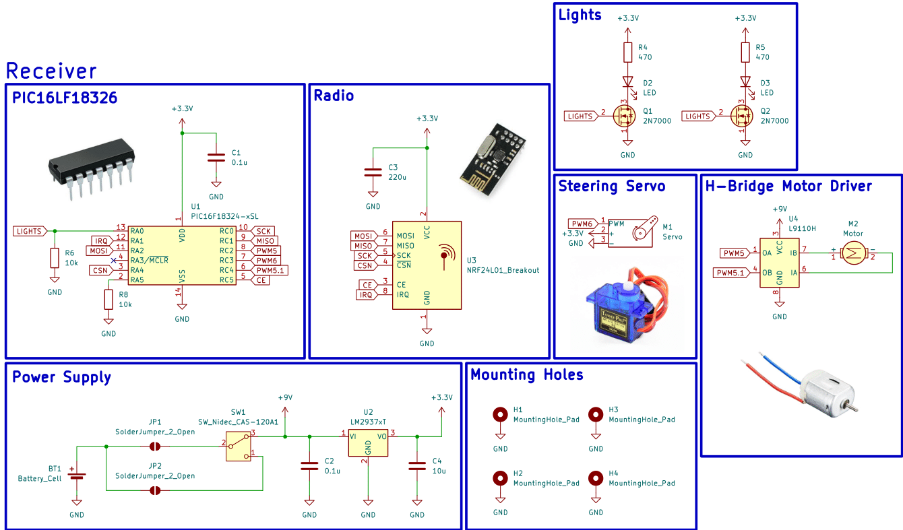
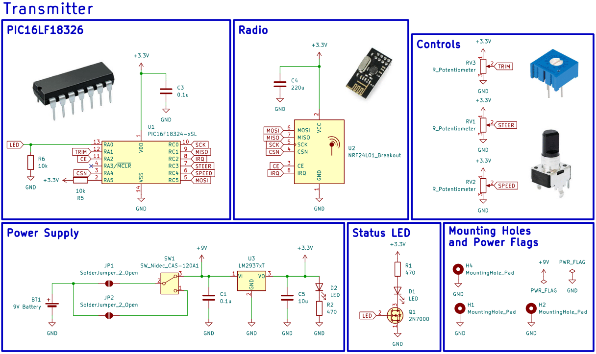

# 9V Battery RC Car
This repo documents how to make an RC car and transmitter using 3D printted parts, a PIC16LF18325 microcontroller, nRF24L01 RF modules, a 9V battery to power the car and the transmitter, and other basic hardware components.

  

Table of contents:  
1. [Design Overview](##design-overview)
2. [Software](###software)
3. [Electrical](###electrical)
4. [Bill of Materials](##bill-of-materials)
## Design Overview
The three main components in building this car are the software, electrical, and the mechanical aspect of the car and controller. The following sections talks about each of these parts in detail.

### Software
Using the PIC16LF18326 as the microcontroller, the driver code was written exclusively in C. The driver code was programmed onto the PIC16 using the MPLAB SNAP and the MPLABX IDE. The software components are broken into the following three files:
1. `main.c`: runs main finite state machine responsible for executing high level transmitter/receiver instructions for controlling motors and servos for the receiver and reading analog control inputs for the trasmitter.
2. `spi.c`: helper SPI functions for transmitting and receiving messages to and from the nRF24L01 radio module.
3. `nRF24L01.c`: helper functions for configuring the nRF24L01 radio module using the `spi.c` functons.

Because this project is intended to be a workshop only one version of code or `main.c` file is written for simplicity. Therefore, for the `main.c` to differentiate between running transmitter code and receiver, a GPIO pin on the micro is dedicated for this indication. The pin under questions is RA5 (pin 2) from the tables below which descripe the pinout for the PIC16 in both the receiver and transmitter. If RA5 is pulled high, then the `main.c` executes transmitter code only. Similarly if RA5 is pulled low, then the `main.c` only executes receiver code. 

| Transmitter Pin Description |             |                |                 | | | Receiver Pin Description    |             |                |                 |
|-----------------------------|-------------|----------------|-----------------|-|-|-----------------------------|-------------|----------------|-----------------|
| **Pin Number**              | **Port**    | **Net Name**   | **Notes**       | | | **Pin Number**              | **Port**    | **Net Name**   | **Notes**       |
| 1                           | $V_{DD}$    | 3.3V           | power supply    | | | 1                           | $V_{DD}$    | 3.3V           | power supply    |
| 2                           | RA5         | 3.3V           | type select     | | | 2                           | RA5         | GND            | type select     |
| 3                           | RA4         | CSN            | SPI bus         | | | 3                           | RA4         | CSN            | SPI bus         |
| 4                           | RA3         | MCLR           | program/NC      | | | 4                           | RA3         | MCLR           | program/NC      |
| 5                           | RC5         | MOSI           | SPI bus         | | | 5                           | RC5         | CE             | radio enable    |
| 6                           | RC4         | SPEED          | pot input       | | | 6                           | RC4         | PWM5.1         | motor PWM       |
| 7                           | RC3         | STEER          | pot input       | | | 7                           | RC3         | PWM6           | servo PWM       |
|                             |             |                |                 | | |                             |             |                |                 |
| 8                           | RC2         | IRQ            | radio interrupt | | | 8                           | RC2         | PWM5           | motor PWM       |
| 9                           | RC1         | MISO           | SPI bus         | | | 9                           | RC1         | MISO           | SPI bus         |
| 10                          | RC0         | SCK            | SPI bus         | | | 10                          | RC0         | SCK            | SPI bus         |
| 11                          | RA2         | CE             | radio enable    | | | 11                          | RA2         | MOSI           | SPI bus         |
| 12                          | RA1         | STEER_TRIM     | pot input       | | | 12                          | RA1         | IRQ            | radio interrupt |
| 13                          | RA0         | LED            | status          | | | 13                          | RA0         | LIGHTS         | status          |
| 14                          | $V_{SS}$    | GND            | power supply    | | | 14                          | $V_{SS}$    | GND            | power supply    |

The following image shows the state machine executed on the transmitter PIC16. When the PIC16 detects its a transmitter then it starts the state machine with the inital state of *COLLECT_ADC_DATA*. In the *COLLECT_ADC_DATA* state, the PIC16 cycles through the three ADC ports to collect their value. Once complete, it transitions to the *TRANSMIT_ADC_DATA* state where it packages up this information into a packet and sents this information over the SPI bus to the nRF24L01 radio module. Once this is complete it then transitions to the *CLEAR_INTERRUPT* state. In this state the PIC16 is waiting for the interrupt line to go low which indicates a successful transmission to the receiver. From here the state machine then transitions to a *DONE* state where the hardware to read the analog pins is reinitialized and the process repeates itself after *DONE* transitions to *COLLECT_ADC_DATA*.

The transmission packet is 8 bytes long and has the following breakdown.
1. Byte 1 is the radio ID and is chosen by the user as an extra indentification method so that in the instance when the radio receives a packet from another RC car on the same channel, it will only execute the instructions if the packet come from a transmitter with the same ID.
2. Byte 2 is the high byte of the ADC conversion value for RC4. The PIC16 has a 10 bit ADC so it takes two bytes to store its value. It stores the eight LSB of the conversion in the first byte and the remaining two bits in the first two bits of the second byte.
3. Byte 3 is the low byte of the ADC conversion value for RC4.
4. Byte 4 is the high byte of the ADC conversion value for RC3.
5. Byte 5 is the low byte of the ADC conversion value for RC3.
6. Byte 6 is the high byte of the ADC conversion value for RA1.
7. Byte 7 is the low byte of the ADC conversion value for RA2.
8. Byte 8 is a checksum of all the bytes transmitted. The checksum is computed by summing all the bytes and subtracting the result from 0xFF. The result is transmitted and the receiver checks the checksum by summing every byte of the packet and if the result is 0xFF then no bits were corrupted or lost.

When the PIC16 detects is a receiver it starts the state machine in the *READ_RX*. In this state it waits until the interrupt line from the nRF24L01 radio module goes low which indicates that a packet has been received. From here it transitions to the *UPDATE_CONTROLS* state. In this state the PIC16 collects the packet from the nRF24L01 radio module, unpacks it, and updates the PWM signals for the servo and motor. Once complete it transitions back to the *READ_RX* state where it waits until the next packet is ready.

### Electrical
The receiver schematic is shown below. For the receiver, the PIC16LF18325 communicates with the nRF24L01 radio module through a SPI bus for receiving commands that are then decoded into a PWM signals for motor and servo control. The PIC16 also controls the motors and servo respectivly and was chosen for its small size, GPIO pin count, and packaging style. The L9110 h-bridge controls the motor and is a very basic h-bridge for driving small motors which make it perfect for this application. The LM2937 linear voltage regulator creates the 3.3V supply for the PIC16, nRF24L01 radio module, lights, and servo power. The lights part of the schematic act as the headlights of the car and are controlled by the PIC16 toggeling the 2N7000 mosfets. 

The transmitter schematic is shown below. In this instance the PIC16 commuicates with the nRF24L01 radio module to send commands for the receiver. The PIC16 also controls the status LED which indicates power and pairing status. The two modes of control are the two potentiometers which act as the cars accelerator and steering control. There is also one trim pot for the driver to tune the front steering axel so that the car does not drift left or right when driving straight.

### Mechanical

## Bill of Materials
| Transmitter Bill of Materials |                 |                |                         |
|-------------------------------|-----------------|----------------|-------------------------|
| **Component**                 | **Quantity**    | **Source**     | **Part Number**         |
| 9V battery                    | 1               | DigiKey        | 547-A1604BK210J-ND      |
| 0.1uF                         | 2               | DigiKey        | BC1084TR-ND             |
| 220uF                         | 1               | DigiKey        | 399-6122-ND             |
| 10uF                          | 1               | DigiKey        | 399-15738-ND            |
| LED                           | 2               | DigiKey        | 732-5016-ND             |
| 2N7000                        | 1               | DigiKey        | 4878-2N7000CT-ND        |
| 470                           | 2               | DigiKey        | CF14JT470RTR-ND         |
| 10k                           | 2               | DigiKey        | CF14JT10K0TR-ND         |
| 5k Control Pot                | 2               | DigiKey        | 2223-PT01-D115D-B502-ND |
| 5k Trim Pot                   | 1               | DigiKey        | 3386P-103LF-ND          |
| Power Switch                  | 1               | DigiKey        | EG1903-ND               |
| PIC16LF18326                  | 1               | DigiKey        | PIC16LF18326-I/P-ND     |
| nRF24L01 Radio Module         | 1               | AliExpress     | [nRF24L01](https://www.aliexpress.us/item/3256809251216534.html?src=google&pdp_npi=4%40dis%21USD%2139.51%2113.30%21%21%21%21%21%40%2112000049096107778%21ppc%21%21%21&snps=y&src=google&albch=shopping&acnt=752-015-9270&isdl=y&slnk=&plac=&mtctp=&albbt=Google_7_shopping&aff_platform=google&aff_short_key=_oDc8nzq&gclsrc=aw.ds&albagn=888888&ds_e_adid=&ds_e_matchtype=&ds_e_device=c&ds_e_network=x&ds_e_product_group_id=&ds_e_product_id=en3256809251216534&ds_e_product_merchant_id=5551326180&ds_e_product_country=US&ds_e_product_language=en&ds_e_product_channel=online&ds_e_product_store_id=&ds_url_v=2&albcp=22665133432&albag=&isSmbAutoCall=false&needSmbHouyi=false&gad_source=1&gad_campaignid=22655435907&gbraid=0AAAAA_eFwRAxECL3osierG--gtRFWs9HU&gclid=CjwKCAjw6P3GBhBVEiwAJPjmLhNZUnYiuj_4ZBXyOOlgW3nIMieQxQGaxVKJq8Jiy7AL6JZ8wVUovBoCkpIQAvD_BwE&gatewayAdapt=glo2usa) |
| LM2937                        | 1               | DigiKey        | LM2937ET-3.3/NOPB-ND    |

| Receiver Bill of Materials             |                 |                |                         |
|----------------------------------------|-----------------|----------------|-------------------------|
| **Component**                          | **Quantity**    | **Source**     | **Part Number**         |
| 9V battery connector                   | 1               | DigiKey        | 547-A1604BK210J-ND      |
| 0.1uF                                  | 2               | DigiKey        | BC1084TR-ND             |
| 220uF                                  | 1               | DigiKey        | 399-6122-ND             |
| 10uF                                   | 1               | DigiKey        | 399-15738-ND            |
| LED                                    | 2               | DigiKey        | 732-5016-ND             |
| 9g Servo                               | 2               | DigiKey        | 732-5016-ND             |
| 2N7000                                 | 1               | DigiKey        | 4878-2N7000CT-ND        |
| 470                                    | 2               | DigiKey        | CF14JT470RTR-ND         |
| 10k                                    | 2               | DigiKey        | CF14JT10K0TR-ND         |
| Power Switch                           | 1               | DigiKey        | EG1903-ND               |
| PIC16LF18326                           | 1               | DigiKey        | PIC16LF18326-I/P-ND     |
| nRF24L01 Radio Module                  | 1               | AliExpress     | [nRF24L01](https://www.aliexpress.us/item/3256809251216534.html?src=google&pdp_npi=4%40dis%21USD%2139.51%2113.30%21%21%21%21%21%40%2112000049096107778%21ppc%21%21%21&snps=y&src=google&albch=shopping&acnt=752-015-9270&isdl=y&slnk=&plac=&mtctp=&albbt=Google_7_shopping&aff_platform=google&aff_short_key=_oDc8nzq&gclsrc=aw.ds&albagn=888888&ds_e_adid=&ds_e_matchtype=&ds_e_device=c&ds_e_network=x&ds_e_product_group_id=&ds_e_product_id=en3256809251216534&ds_e_product_merchant_id=5551326180&ds_e_product_country=US&ds_e_product_language=en&ds_e_product_channel=online&ds_e_product_store_id=&ds_url_v=2&albcp=22665133432&albag=&isSmbAutoCall=false&needSmbHouyi=false&gad_source=1&gad_campaignid=22655435907&gbraid=0AAAAA_eFwRAxECL3osierG--gtRFWs9HU&gclid=CjwKCAjw6P3GBhBVEiwAJPjmLhNZUnYiuj_4ZBXyOOlgW3nIMieQxQGaxVKJq8Jiy7AL6JZ8wVUovBoCkpIQAvD_BwE&gatewayAdapt=glo2usa) |
| LM2937                                 | 1               | DigiKey        | LM2937ET-3.3/NOPB-ND    |
| L9110H                                 | 1               | DigiKey        | 1528-4489-ND            |

